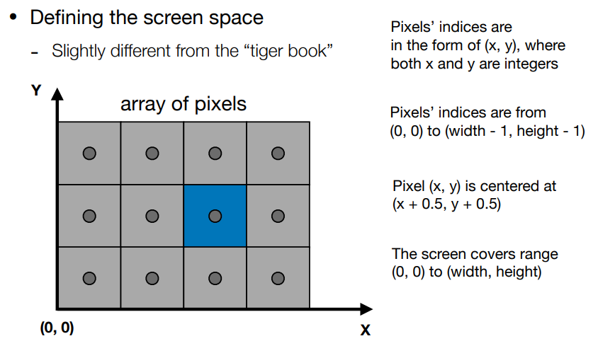
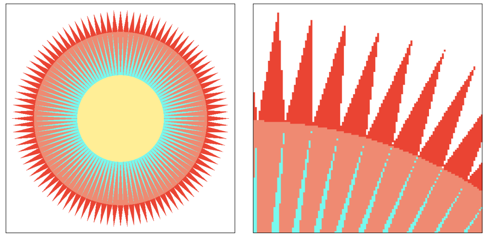
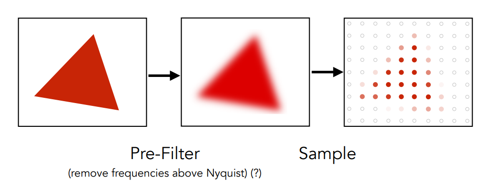
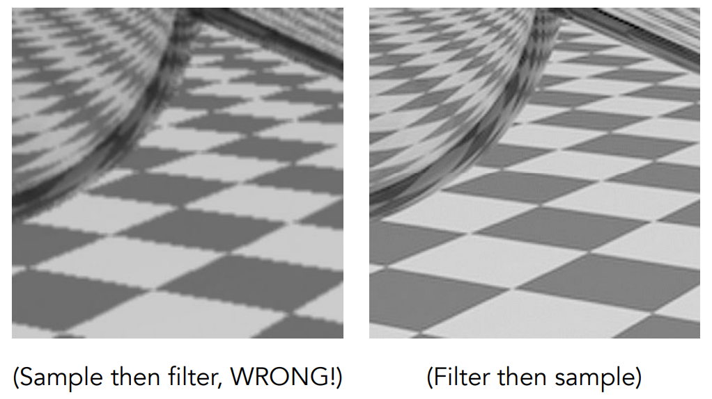

# 光栅化

# 标准立方体到屏幕
## 屏幕
* 像素的数组
* 分辨率：数组的大小
* 光栅成像设备

`raster`在德语中有表示屏幕的意思，光栅化就是表示画到屏幕上。

## 像素
Pixel(FYI. Picture elemenet)
* 目前，可以认为像素是一个均匀的小方块（方块内的颜色不会出现差异）。
> 该描述是不准确的，主要便于理解。
* 颜色是RGB的混合。

## 屏幕空间

## 视口(viewport)转换
转换 $[-1, 1]^3$ 到 $[0, width] \times [0, height]$ ：
* 不关心z
* 转换xy平面 $[-1, 1]^2$ 到 $[0, width] \times [0, height]$
* 先缩放再平移到屏幕中心点
$$
M_{viewport}=
\begin{bmatrix}
w/2 & 0 & 0 & w/2 \\
0 & h/2 & 0 & h/2 \\
0 & 0 & 1 & 0 \\
0 & 0 & 0 & 1 \\
\end{bmatrix}
$$

# 反走样(Antialiasing)

采样是广泛应用于CG中的：
* 光栅化 = 对平面中的点进行取样
* 照片 = 图片传感器平面的取样
* 视频 = 对时间取样

## 取样瑕疵(sampling artifacts)
> artifact一般译作人造物，工艺品等，不过也有以下释义： 
> something observed in a scientific investigation or experiment that is not naturally present but occurs as a result of the preparative or investigative procedure. 
> 在这里，Artifacts包含`Errors`, `Mistakes`, `inaccuracies`。

### 举例
* 锯齿(jaggies)
* 摩尔纹(moire)
  将图片奇数行和奇数列去掉，会产生扭曲纹理。
* 车轮效应(Wagon wheel effect) 
  人眼跟不上轮子滚动的速度，采样有瑕疵，感觉有些轮子是逆时针转，有些是顺时针转。

本质都是信号变化太快了（频率高）而采样太慢了导致的走样。

## 模糊处理

原来的取样点不是红就是白，这里先针对原图形进行模糊处理，然后取样点不局限于两种颜色。

先获得走样图形再模糊处理和反过来的效果是不一样的。

## 频域(frequency domain)

# 可见性/遮挡性(Visibility/Occlusion)

# 深度缓冲(Z-Buffering)

