# 几何 (Geometry)

## 隐式几何(Implicit geometry)

## 显式几何(Explicit geometry)
* 三角形网格(triangel meshes)
* 贝塞尔表面(Bezier surface)
* 曲面细分(subdivision surfaces)
* NURBS
* 点云(point clouds)
* ...

### 点云(point cloud)
点云是最简单的表示方式，用一堆三维点表示。 
彼此之间的缝隙足够小，可以形成几何体。

对于大数据集有效，通常需要转化为多边形网格。 

### 多边形网格(Polygon Mesh)
存储顶点和多边形面，通常是三角形或四边形(quads)。 
适合用于处理、模拟和自适应采样(adaptive sampling)。 
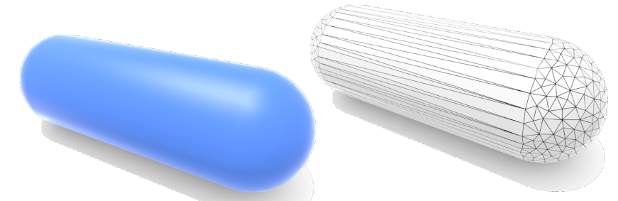

一种常用(且古老)的描述文件格式是[Wavefront的.obj文件](https://en.wikipedia.org/wiki/Wavefront_.obj_file)，里面记录顶点坐标以及多边形面，当然还有其他顶点相关属性。
### 曲线(Curves)
主要讨论贝塞尔曲线。 
可以观看贝塞尔曲线的[形成动画](https://www.jasondavies.com/animated-bezier/)来直观感受贝塞尔曲线是如何生成的。 

贝塞尔曲线由多个`控制点`定义，可以通过拖动控制点来控制曲线的弯曲程度，通过`参数化的公式`生成各种光滑、连续的曲线。从而可以良好地满足各种作图需求。 
被广泛应用于各种制图软件，比如Photoshop等，用于编辑矢量图。 

通过控制点定义的贝塞尔曲线获得了一些相关的性质：
* 曲线开始于b0而终止于bn(endpoint interpolation property)。
* 当所有控制点均在一条线上(共线性)时，曲线呈现为直线（当且仅当）。
* 起点和终点在曲线的切线上，切线会沿着控制点的连线方向往外移动，并渐渐偏向终点
* ...

更多性质可以参考[wikipedia](https://en.wikipedia.org/wiki/B%C3%A9zier_curve)。

#### de Casteljau's Algorithm
考虑如下三个点(二阶贝塞尔)： 
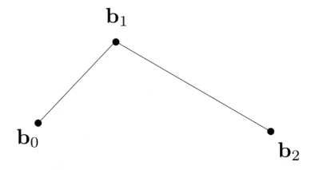 

如何根据这3个控制点将贝塞尔曲线绘制出来？ 
采用时间段`[0, 1]`采样曲线上的点来绘制图形。 
在时间0，曲线在b0，在时间1，曲线在b2。 
给定任意一个时间`t`(in [0, 1])，找到一个确定的点在曲线上。
在b0b1上找时间t的位置，b1b2上找时间t的位置，将这两个点连起来，然后取时间t的位置，该点就是贝塞尔曲线在时间t的位置。 
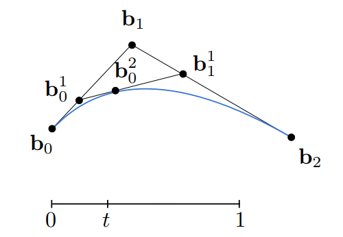

对于四个控制点形成的3阶贝塞尔曲线，类似前面的做法，取b0b1，b1b2，b2b3的时间t位置，得到两条线，转换为了之前的情形。 
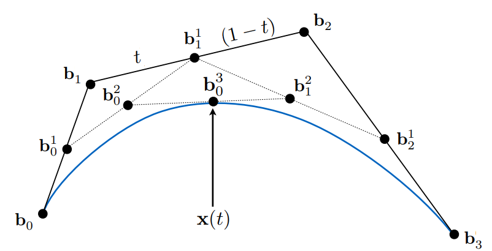
对于更高阶的贝塞尔曲线则是通过`递归`的方式简化原问题，最终通过子问题获得最终曲线上的点。

#### 代数公式(Algebraic Formula)
考虑三阶贝塞尔曲线：
$$
\begin{align}
b_0^1(t) &= (1-t)b_0+tb_1 \\
b_1^1(t) &= (1-t)b_1+tb_2 \\

b_0^2(t)
&= (1-t)b_0^1+tb_1^1 \\
&= (1-t)^2b_0 + 2t(1-t)b_1 + t^2b_2
\end{align}
$$
可以看出各个控制点的系数实际是 $((1-t) + t)^2$ 的展开项。

实际上，如此类推下去会得到n阶贝塞尔曲线公式：
$$
b^n(t) = b^n_0(t)=\sum^n_{j=0}b_jB_j^n(t)
$$
其中， $B_j^n(t)$ 是`Bernstein`多项式，表示的就是二项式公式的项：
$$
B_j^n(t) = 
\begin{pmatrix}
n \\
i \\
\end{pmatrix}
t^j(1-t)^{n-j}
$$

另外，在任何时刻，bernstein多项式的和总是1： 
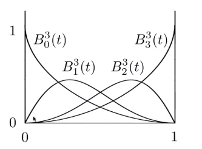

从贝塞尔曲线公式的角度来看，每个点的贡献值加起来为1。 
从组合来看，从n个物体中随机抽取i个和抽取n-i个是等概率的，因此图像会呈现对称。

#### 性质
* interpolates endpoints 
  $b(0)=b_0, b(1)=b_3$
* Tangent to end segments(与起终点线段相切) 
  $b^\prime(0)=3(b_1-b_0), b^\prime(1)=3(b_3-b_2)$
* Affine transformation property(仿射变换不变性) 
  对控制点进行仿射变换再绘制曲线等价于对曲线上所有点进行仿射变换 
  注意，透视投影因为齐次除法，并不是纯仿射变换。
* Convex hull property(凸包特性) 
  曲线包含在控制点形成的凸包中

#### 分段贝塞尔曲线(Piecewise Bezier Curve)
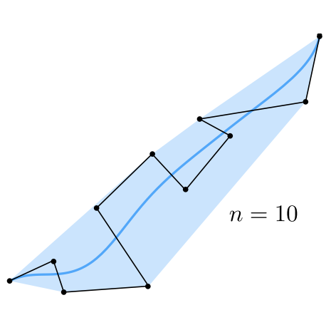 
当控制点过多时，难以控制。相反，用少数控制点的多个曲线连接在一起是更易于控制且常用的手法。 
其中，3阶贝塞尔曲线是最常用的。 
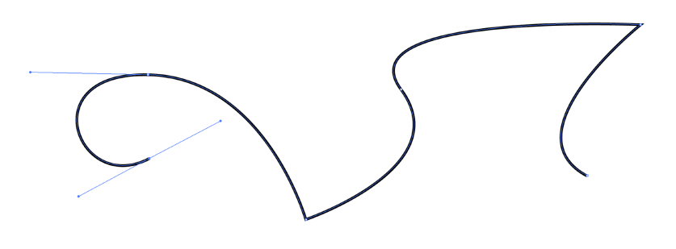 
[分段3阶贝塞尔曲线demo](https://math.hws.edu/eck/cs424/notes2013/canvas/bezier.html) 

#### 连续性
当一个曲线的终点和下一个曲线的起点与相邻的控制点形成的切线线段大小相同方向相反时，在该点(光滑)连续。 
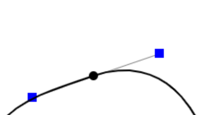 
这个是切线上的连续。

* 几何上的连续
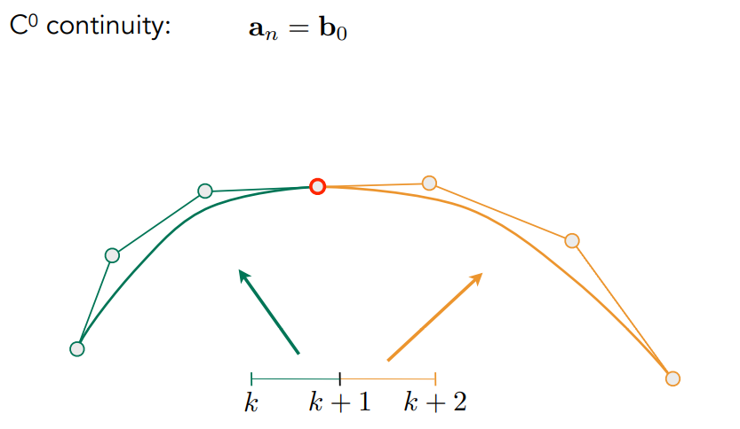 
* 切线上的连续(一阶导数连续)
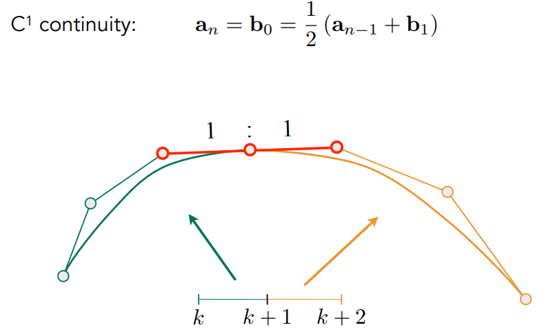 
* 曲率上的连续(二阶导数连续)

### Spline(样条)
通过一系列的控制点从而构造的具有一定数目连续导数的连续曲线。 
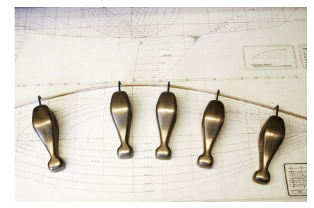

#### B-splines(Basis splines)
* 贝塞尔曲线的超集 
不类似于分段贝塞尔曲线，但是同样有多个点可以控制曲线，相比前者需要改动的点更少。

#### NURBS(非均匀有利B样条)

[深入学习的资料](https://www.bilibili.com/video/av66548502?from=search&seid=65256805876131485)

### 曲面(Surfaces)
#### 贝塞尔曲面
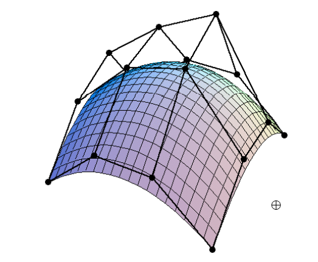 
贝塞尔曲面拥有16个控制点，两个轴各有4个控制点。 

如果根据这16个控制点绘制曲面？ 
设曲面的坐标为$(u, v) \in [0,1]^2$。 
* 对每个u轴的4个控制点应用2D de Casteljau算法获取曲线坐标，在v轴方向上获取到了4个新控制点$(u, v_{1-4})$
* 对这四个新控制点应用2D de Casteljau算法获取曲线坐标，绘制了这个u坐标对应的曲线

如此移动与v轴平行的曲线，可以获取每个u对应的曲线，构成了曲面。 
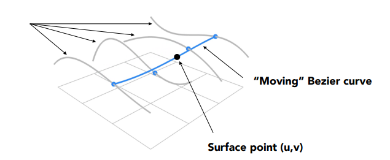 
由于仿射变换不变性，$[0, 1]^2 \rightarrow [width, height]^2$是等价的图形。

## 网格操作(Mesh Operations)
* 网格细分(Mesh subdivision) 
将网格面细分为更小的三角面，表现更细致
* 网格简化(Mesh simplification) 
将网格面划分为更大的三角面，减少存储量
* 网格正规化(Mesh regularization) 
将形状各异的三角面转化为与正三角形相似的面(均匀)从而获得更好的性质

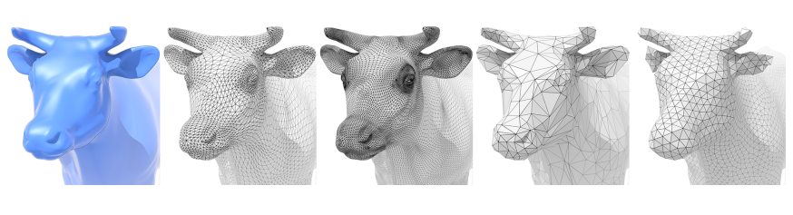

## 细分(Subdivision)
* 分出更多三角形
* 调整三角形位置，使几何体变光滑

### Loop细分(Loop subdivision)
* 根据中位线将一个三角形分成4个三角形 
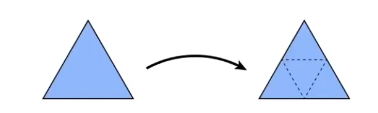
* 根据权重赋予新的顶点位置，旧顶点也随之更新位置

### Catmull-Clark细分(General Mesh)
