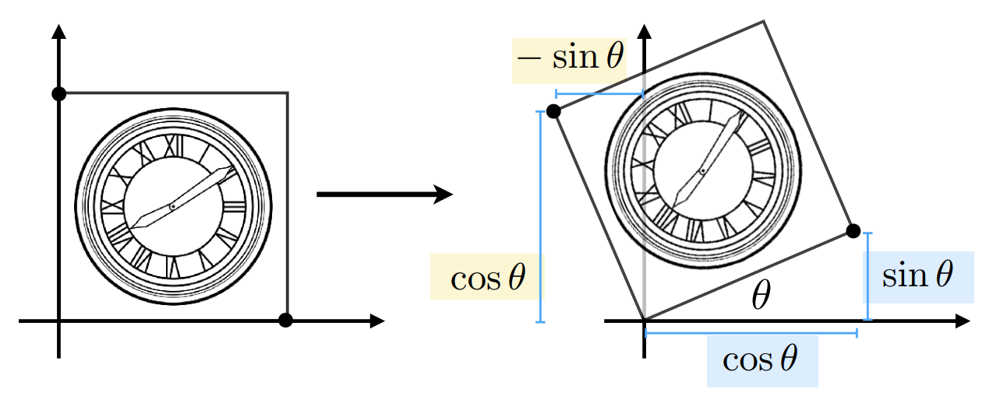
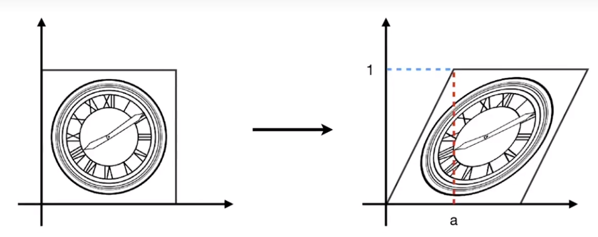
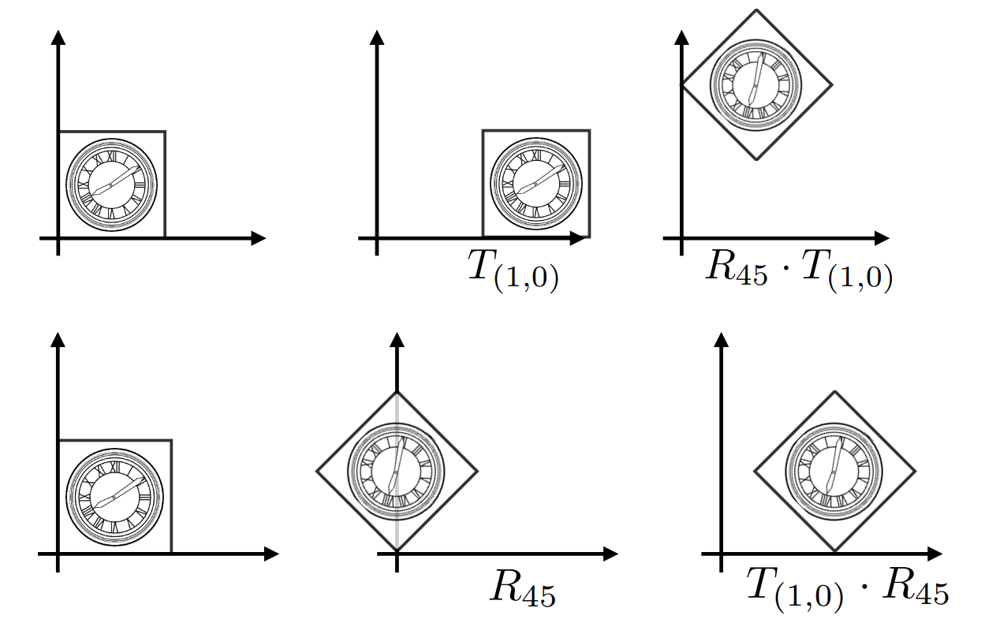
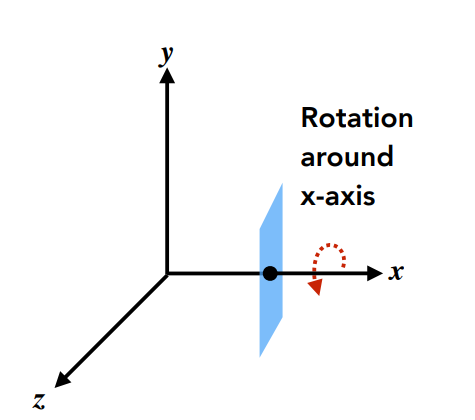
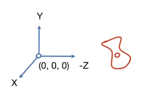
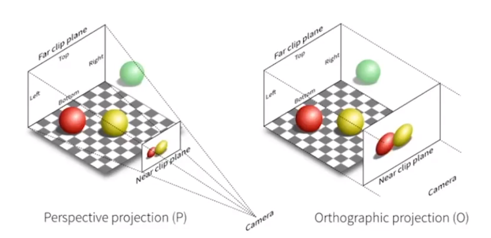
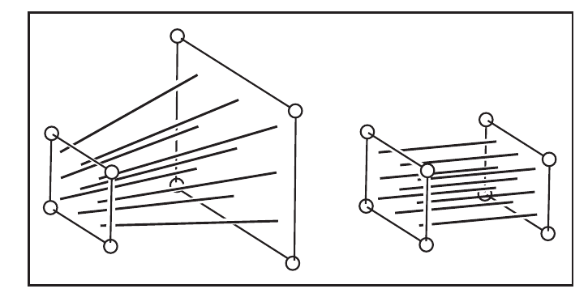
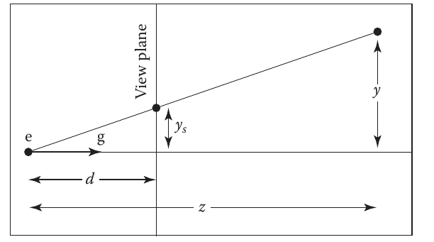

# Lecture3: 转换
# 目的
* 建模（modeling）
  * 平移（translation）
  * 旋转（rotation）
  * 缩放（scaling）
  * ...
* 观测（viewing）
  * 3D到2D的投影
# Scale matrix

缩放系数分别为 $s_x$ ， $s_y$ ，当两者相等时，为统一缩放（uniform scale）。

$$
\begin{bmatrix}
s_x & 0 \\
0 & s_y \\
\end{bmatrix}
\begin{bmatrix}
x \\ 
y \\
\end{bmatrix}
\=
\begin{bmatrix}
x^\prime \\ y^\prime \\
\end{bmatrix}
$$

# Reflection matrix
沿y轴对称。

$$
\begin{bmatrix}
-1 & 0 \\
0 & 1 \\
\end{bmatrix}
\begin{bmatrix}
x \\
y \\
\end{bmatrix}
\=
\begin{bmatrix}
x^\prime \\
y^\prime \\
\end{bmatrix}
$$

# Rotate matrix

假设R为旋转矩阵，

$$
R 
\=
\begin{bmatrix}
a & b \\
c & d \\
\end{bmatrix}
$$

通过(0, 1)和(1, 0)两个点可以获得所有待定系数：

$$
\begin{align}
\begin{bmatrix}
a & b \\
c & d \\
\end{bmatrix}
\begin{bmatrix}
1 \\ 0 \\
\end{bmatrix}
&=
\begin{bmatrix}
cos\theta \\ sin\theta \\
\end{bmatrix}  \\
\\
\begin{bmatrix}
a & b \\
c & d \\
\end{bmatrix}
\begin{bmatrix}
0 \\ 1 \\
\end{bmatrix}
&=
\begin{bmatrix}
-sin\theta \\ 
cos\theta \\
\end{bmatrix}
\end{align}
$$

所以R如下：

$$
R =
\begin{bmatrix}
cos\theta & -sin\theta \\
sin\theta & cos\theta \\
\end{bmatrix}
$$

# Shear(剪切) matrix

$$
\begin{bmatrix}
x{^\prime} \\
y{^\prime}
\end{bmatrix}
\= 
\begin{bmatrix}
1 & a \\
0 & 1\\
\end{bmatrix}
\begin{bmatrix}
x \\
y \\
\end{bmatrix}
$$

至此，所有的变换都是线性变换

# Translation(平移) matrix
> Translation有如下释义： 
> the process of moving something from one place to another. 
> 这里译作“平移”。

平移不能用 $x^\prime = Mx$ 的形式表示：

$$
\begin{bmatrix}
x^\prime
y^\prime
\end{bmatrix}
\=
\begin{bmatrix}
a & b \\
c & d \\
\end{bmatrix}
\begin{bmatrix}
x \\ y \\
\end{bmatrix}
+
\begin{bmatrix}
t_x \\ t_y \\
\end{bmatrix}
$$

为了统一所有变换的表示方式，引入齐次坐标（Homogeneous coordinates）。

# Homogeneous coordinates
* 2D点： $[x, y, 1]^T$
* 2D向量： $[x, y, 0]^T$

之所以这样约定，我们可以先来看下引入齐次坐标后是如何表示平移的：

$$
\begin{bmatrix}
1 & 0 & t_x \\
0 & 1 & t_y \\
0 & 0 & 1 \\
\end{bmatrix}
\begin{bmatrix}
x \\ y \\ 1
\end{bmatrix}
\=
\begin{bmatrix}
x+t_x \\
y+t_y \\
1 \\
\end{bmatrix}
$$

齐次坐标增加了一个新的维度，利用行变换的特点，在新列上放置平移量，为了加平移量，这里点坐标必须为 **$(x, y, 1)$**，
而新行只有最后一个坐标必须是1，因为复合转换中平移可能不止一次。

而对于向量，它表示方向或是两个点的偏移，对于它的平移，其指向并不会变化，因此是天然统一的，第三坐标为0就行了。

$$
\begin{bmatrix}
1 & 0 & t_x \\
0 & 1 & t_y \\
0 & 0 & 0 \\
\end{bmatrix}
\begin{bmatrix}
x \\ y \\ 0
\end{bmatrix}
\=
\begin{bmatrix}
x \\
y \\
0 \\
\end{bmatrix}
$$

除此之外，它们应当满足以下关系：
* vector + vector = vector
* point - point = vector
* point + vector = point(点+向量实际是沿着向量平移)
* point + point = ？

在齐次坐标中，有如下约定：

$$
(x, y, w)和(x/w, y/w, 1)等价，w \ne 0
$$

所以点+点表示的是 *两个点的中点*。

# 仿射(Affine)转换
仿射转换说白了就是`线性转换+偏移(Shift)`。

$$
\begin{bmatrix}
x^\prime \\
y^\prime \\
\end{bmatrix}
\=
\begin{bmatrix}
a & b \\
c & d \\
\end{bmatrix}
\begin{bmatrix} x \\ y \end{bmatrix}
+
\begin{bmatrix} t_x \\ t_y \end{bmatrix}
$$

用齐次坐标可以 *用线性转换的形式表示仿射转换*。

接下来描述转换矩阵，均采用齐次坐标的方式表示以用线性关系的形式表示所有转换。

## Scale
$$
S(s_x, s_y) 
\= 
\begin{bmatrix}
s_x & 0 & 0 \\
0 & s_y & 0 \\
0 & 0 & 1 \\
\end{bmatrix}
$$

## Rotation
$$
R(\theta) 
\=
\begin{bmatrix}
cos\theta & -sin\theta & 0 \\
sin\theta & cos\theta & 0 \\
0 & 0 & 1\\
\end{bmatrix}
$$

## Translation
$$
T(t_x, t_y) 
\=
\begin{bmatrix}
1 & 0 & t_x \\
0 & 1 & t_y \\
0 & 0 & 1 \\
\end{bmatrix}
$$

# 反转换
反转换矩阵就是转换矩阵的逆矩阵 $M^{-1}$

# 复合转换(Composite transform)
转换的顺序必须按照顺序来，因为矩阵乘法并没有交换律（即使确实存在有些情形恰好满足）。 

# 分解复杂转换(Decomposing Complex Transforms)

# 3D转换
对于缩放和平移的转换矩阵可以直接类比2D版本。

对于旋转，先讨论绕特定轴的旋转： 

从x轴的角度看，逆时针旋转是 $y =>z$，因此用二维旋转的坐标系类比: $(y, z) => (x, y)$。 
同理，绕y轴是 $(z, x) => (x, y)$；绕z轴是 $(x, y) => (x, y)$。 

$$
\begin{align}
R_x(\alpha)
&=
\begin{bmatrix}
1 & 0 & 0 & 0 \\
0 & cos\theta & -sin\theta & 0\\
0 & sin\theta & cos\theta & 0\\
0 & 0 & 0 & 1 \\
\end{bmatrix}
\\
R_y(\alpha) 
&=
\begin{bmatrix}
cos\theta & 0 & sin\theta  & 0 \\
0 & 1 & 0 & 0 \\
-sin\theta & 0 & cos\theta & 0 \\
0 & 0 & 0 & 1 \\
\end{bmatrix}
\\
R_z(\alpha)
&= 
\begin{bmatrix}
cos\theta & -sin\theta & 0 & 0 \\
sin\theta & cos\theta & 0 & 0 \\
0 & 0 & 1 & 0 \\
0 & 0 & 0 & 1\\
\end{bmatrix}
\end{align}
$$

如何表示任意旋转（绕任何轴）？
* 组合三种轴旋转为任意旋转

$$
R_{xyz}(\alpha, \beta, \gamma) = R_x(\alpha)R_y(\beta)R_z(\gamma)
$$

* Rodfrigues 旋转公式
绕n轴旋转 $\alpha$：

$$
R(n, \alpha) 
\= cos\alpha \cdot I + (1-cos\alpha)nn^T+sin\alpha
\begin{bmatrix}
0 & -n_z & n_y \\
n_z & 0 & -n_x \\
-n_y & n_x & 0 \\
\end{bmatrix}
$$

# Viewing(观测) Transformation
# View(视图)/Camara Transformation
## 定义照相机
* 位置(Position): $\vec{e}$
* 注视方向(Look-at/gaze direction): $\vec{g}$
* 向上方向(Up direction): $\vec{t}$

如果不规定向上方向，那么会导致拍出的照片倾斜、颠倒。

## 照相机的标准摆放
* 位置：原点
* 注视方向：-Z( $\vec{x} \times \vec{y}$ 用右手定则观察确实是-Z)
* 向上方向：Y

## 转换为标准摆放
求转换矩阵( $M_{view}$ )，由旋转矩阵( $R_{view}$ )和平移矩阵( $T_{view}$ )构成：
* 先平移到原点

  $$
  T_{view} =
  \begin{bmatrix}
  1 & 0 & 0 & -x_e \\
  0 & 1 & 0 & -y_e \\
  0 & 0 & 1 & -z_e \\
  0 & 0 & 0 & 1 \\
  \end{bmatrix}
  $$
  
* 旋转 $g \rightarrow -Z$ ， $t \rightarrow Y$， $g \times t \rightarrow X$ ， 
  但是g，t和它们的叉积形成的正交基可能是任意的，因此可能需要沿任意轴进行旋转。 
  **反向思维** ：反向旋转得到逆矩阵，再反转回来。
  
  $$
  R^{-1}_{view}
  \=
  \begin{bmatrix}
  x_{g \times t} & x_t & x_g & 0\\
  y_{g \times t} & y_t & y_g & 0\\
  z_{g \times t} & z_t & z_g & 0\\
  0 & 0 & 0 & 1 
  \end{bmatrix}
  $$
  
  由于是正交基，假设都为单位向量，那么 $Q^TQ=I$，进而 $Q^{-1}=QT$。
  
  $$
  R_{view}
  \=
  (R^{-1}_{view})^{-1}=(R^{-1}_{view})^T=
  \begin{bmatrix}
  x_{g \times t} & y_{g \times t} & z_{g \times t} & 0\\
  x_t & y_t & z_t & 0\\
  x_g & y_g & z_g & 0\\
  0 & 0 & 0 & 1\\
  \end{bmatrix}
  $$

Aka. `ModelView Transformation`。

# 投影转换(Projection transformation)
分为两种投影：
* 正交投影(Orthographic projection)
* 透视投影(Perspective projection)

## 正交投影
映射立方体 $[l, r] \times [b, t] \times [f, n]$ 到标准(canonical)的立方体区域 $[-1, 1]^3$ 中
> $[l, r] \times [b, t] \times [f, n]$表示 $x=l,r, y=b,t, z= f, n$ 构成的立方体 
> PS. l=left, r=right, b=bottom, t=top, f=far, n=near

### 步骤
* 将中心(center)平移到原点上

$$
M_{trans}=
\begin{bmatrix}
1 & 0 & 0 & -\frac{l+r}{2} \\
0 & 1 & 0 & -\frac{b+t}{2} \\
0 & 0 & 1 & -\frac{f+n}{2} \\
0 & 0 & 0 & 1 \\
\end{bmatrix}
$$

* 缩放为标准立方体

$$
M_{scale}=
\begin{bmatrix}
\frac{2}{r-l} & 0 & 0 & 0 \\
0 & \frac{2}{t-b} & 0 & 0 \\
0 & 0 & \frac{2}{n-f} & 0 \\
0 & 0 & 0 & 1 \\
\end{bmatrix}
$$

所以转换矩阵为

$$
M_{ortho}=
M_{scale}M_{trans}
$$

> PS. OpenGL是左手坐标系，因此远近不是-Z

## 透视投影
### 特征
* 符合近大远小
* 平行线相交于一个点而不是永远平行（不符合欧氏几何）

### 步骤
* 挤压(squish)视 锥体(frustum)为立方体( $M_{squish}$ )
* 对该立方体做正交投影( $M_{ortho}$ )

第二步需要的转换矩阵已经推导过了，
关键在于第一步的转换矩阵如何求得？

通过与y轴平行的平面获取截面可以得到y的转换方程：

$$
y^\prime = \frac{d}{z}y
$$

类似地，与xz平面平行的平面获取截面可以得到x的转换方程：

$$
x^\prime = \frac{d}{z}x
$$

一个新的问题是透视投影需要转换 $z$ 坐标吗？ 

但是没有一个合适的平面可以获取截面得到z的转换方程，我们只能暂时得到如下方程：

$$
M
\begin{bmatrix}
x \\
y \\
z \\
1
\end{bmatrix}
\=
\begin{bmatrix}
\frac{d}{z}x \\
\frac{d}{z}y \\
? \\
1
\end{bmatrix}
\sim
\begin{bmatrix}
dx \\
dy \\
? \\
z
\end{bmatrix}
$$

不难猜测 $M$ 具有如下形式：

$$
M \=
\begin{bmatrix}
d & 0 & 0 & 0 \\
0 & d & 0 & 0 \\
? & ? & ? & ? \\
0 & 0 & 1 & 0 \\
\end{bmatrix}
$$

问题在于如何获得第三行？

由于近平面和远平面的$z =f/n$，z并不会变化（投影平面和远平面是同一个），所以用d代替可以得到两个方程：

$$
M
\begin{bmatrix}
x \\
y \\
n \\
1 \\
\end{bmatrix}
\= 
\begin{bmatrix}
x \\
y \\
n \\
1 \\
\end{bmatrix}
\=
\begin{bmatrix}
nx \\
ny \\
n^2 \\
n \\
\end{bmatrix}
$$

对于透视投影，x和y对z的转换没有贡献（因为表示远近），即与x，y无关，因此前两个系数为0。

$$
\begin{bmatrix}
0 & 0 & A & B
\end{bmatrix}
\begin{bmatrix}
x \\
y \\
n \\
1 \\
\end{bmatrix}
\= n^2
$$

远平面同理可得：

$$
\begin{bmatrix}
0 & 0 & A & B
\end{bmatrix}
\begin{bmatrix}
x \\
y \\
f \\
1 \\
\end{bmatrix}
\= f^2
$$

不难解得：

$$
\begin{align}
A &=  n+f \\
B &= -nf  \\
\end{align}
$$

所以最终，挤压转换矩阵为：

$$
M_{squish}
\=
\begin{bmatrix}
d & 0 & 0 & 0 \\
0 & d & 0 & 0 \\
0 & 0 & n+f & -nf \\
0 & 0 & 1 & 0 \\
\end{bmatrix}
$$

所以透视投影矩阵为：

$$
M_{pers} \= M_{ortho}M_{squish}
$$

